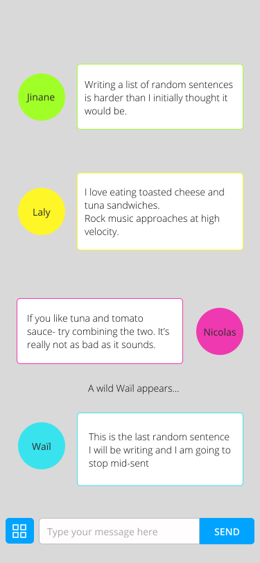
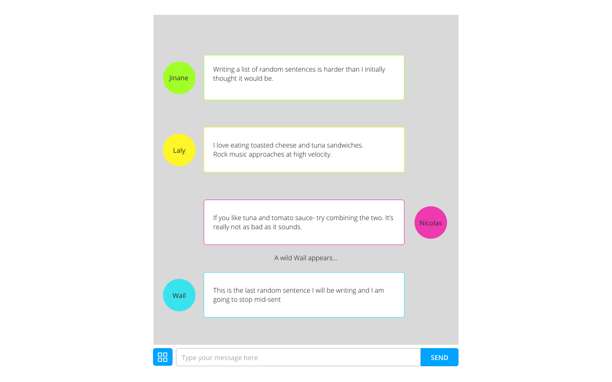
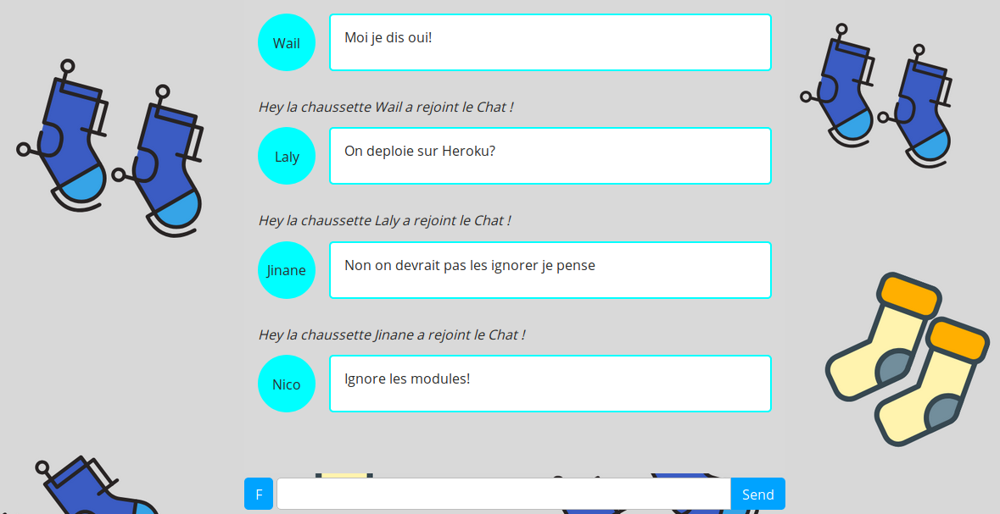

# Online Chat Web App using Node.js
You can see the project here [here](https://chatwalaniji.herokuapp.com/)

## Motivation behind this?
Group project part of BeCode training in Brussels. 4 days to do this.  
Collaborators :
- [Wail](https://github.com/wailmadrane)
- [Nicolas](https://github.com/Nico-becode)
- [Laly](https://github.com/lalsdev)

We have to build an online chat app using the following technologies : 
- Node.js
- install libraries via npm dependency manager
- librairies to use : 
	- Express.js -> web application framework
	- Socket.io -> library enabling real-time interactions between the client and the server side

## Mission
- Write our server with Node.js and Express.js
- Handle requests from the client side and server side in real-time 
- Allow different users to interact in the chatbot
- Keep messages even when the page is refreshed

If we finish this we can think of implementing the following :
 - Implement a battleship game
 - Users can write in MarkDown in the chatbot
 - Users can edit or delete their messages
 - Update user info : picture, pseudo, description

## How we organize ourselves
Day 1 :
- From the start we decide we will meet at the beginning and end of the day to discuss how we get on
- Set up a project on Github for everyone to have a space to leave notes about the project advancement
- Understand what is required to build the project
- We team up in pairs to work on parts of the project
	- Laly and Jinane working on learning how socket works to build the chat
	- Nicolas and Wail on creating mockups and thinking UI, UX
Day 2 :
- Nico : working on finding a way to implement a markDown feature in the Chat
- Jinane and Laly : working on following a tutorial to implement chat
- Wail : working on the mockup + html and css
- Collective contribution : merging front and back branch and merge into development branch

Day 3 :
- Collective contribution :  working on the back-end, adding session system

Day 4:
- Didn't use sessions instead used a database
- Deployment
- Adding Background to project
- Integrate messages with Front

## Mock-ups
### Mobile

### Desktop

### Front-end tools:
- Mockup tool : Figma
- Background image : Canva

## Overview desktop 

### Back-end tools:
- Dependency Manager : NPM
- Librairies :
	- Express.js
	- Socket.io
- Deployment : Heroku

## Progression
- add database to keep messages when reloading the page
- add features

## Credits
December 2019  

